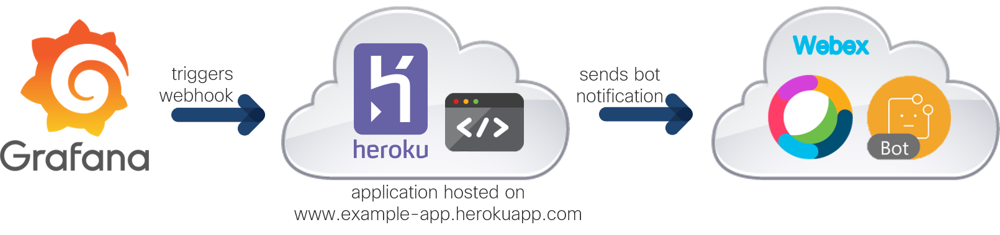

# Webex Bot for DOM Telemetry Application

A notifier bot created for the [DOM Telemetry Application](https://www.github.com/gve-sw/DOM-Telemetry_app). It is based on the [Automated Webex Bot Deployment to Heroku](https://github.com/gve-sw/WebexBot_HerokuDeployment) repository, which is containerized in the DOM Telemetry Application.  

## Overview
The bot is hosted on [Heroku](https://www.heroku.com) and sends alerts from [Grafana](https://grafana.com/) to [Webex](https://www.webex.com/):

As part of the [DOM Telemetry Application](https://www.github.com/gve-sw/DOM-Telemetry_app), the bot is automatically deployed on Heroku and the webhook configured in Grafana during container start. Visit the [Automated Webex Bot Deployment to Heroku](https://github.com/gve-sw/WebexBot_HerokuDeployment) repository for more information on Webex bots, Heroku app deployment, and webhooks. 

## Contacts
* Jara Osterfeld (josterfe@cisco.com)

## Solution Components
* Webex Bot
* Heroku
* Grafana
* Python 

## License
Provided under Cisco Sample Code License, for details see [LICENSE](./LICENSE.md).

## Code of Conduct
Our code of conduct is available [here](./CODE_OF_CONDUCT.md).

## Contributing
See our contributing guidelines [here](./CONTRIBUTING.md).